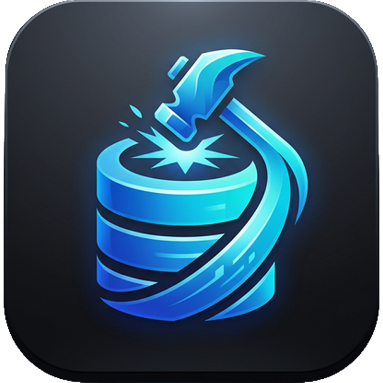

# Data Forge v1.1.0

**Data Forge** is an enterprise-grade, high-performance database management studio and AI-powered SQL editor built with **Next.js** and **Electron**. It provides a unified, multi-tabbed workspace for managing **SQL Server (MSSQL)**, **PostgreSQL**, **MySQL**, and **MariaDB** with a premium "Obsidian-Glass" aesthetic.

Optimized for high-productivity database engineering, Data Forge combines traditional administration tools with modern AI capabilities.



---

## 🚀 Features (v1.1.0 Updates)

### 🤖 AI Forge (Intelligence)
- **Enhanced AI SQL Fixer** — Now features a multi-step analysis process with real-time reasoning feedback and a visual progress bar.
- **Cross-Database Intellisense** — Intelligent code completion that works across ALL explored databases on your server simultaneously.
- **AI Performance Advisor** — Analyze execution plans and get actionable index recommendations using AI diagnostics.
- **"Explain with AI"** — Get human-readable breakdowns of complex SQL queries and execution plans.

### 🗂 Core Workspace & Connectivity
- **Tab Persistence** — Your open tabs, SQL queries, and table views are now saved and restored per database connection.
- **Auto-Connect** — Securely cached credentials now support one-click connection directly from the dashboard.
- **Improved MySQL Core** — Added support for **TLSv1.3**, auto-retry mechanisms, and optimized connection strings for high-latency environments (Tailscale/VPN).
- **Consolidated Forge Sidebar** — A unified, collapsible section for all tools (Table/View Designers, AI, Monitor) under "FORGE TOOLS & ACTIONS".

### ⌨️ SQL Editor
- **Run Selection** — Execute only the highlighted SQL code in the editor.
- **Monaco-Powered Editor** — Syntax highlighting, schema-aware autocomplete, and multi-cursor editing.
- **Visual Query Builder** — Drag-and-drop interface to build complex multi-table JOIN queries.
- **Local Query History** — Searchable log of executed queries with one-click replay.

### 📊 Schema & Developer Tools
- **The Designer Suite** — Visual builders for **Tables, Views, and Procedures/Functions**.
- **ER Architect** — Interactive entity-relationship diagrams generated from live database foreign keys.
- **Import Wizard** — High-speed data import from CSV/JSON.
- **Schema Comparison** — Identify and diff schema changes between two databases.
- **Server Health Monitor** — Real-time performance monitoring.

---

## 🛠 Tech Stack

| Layer | Technology |
|---|---|
| **Framework** | [Next.js](https://nextjs.org/) (App Router, Static Export) |
| **Desktop Wrapper** | [Electron](https://www.electronjs.org/) |
| **SQL Editor** | [Monaco Editor](https://microsoft.github.io/monaco-editor/) |
| **Styling** | Vanilla CSS (Obsidian-Glass) & Lucide Icons |
| **Drivers** | `tedious` (MSSQL), `pg` (PostgreSQL), `mysql2` (MySQL) |
| **AI Integration** | OpenAI, Anthropic, Gemini, Z.ai & local Ollama support |

---

## 📦 Getting Started

### Installation

1. Clone the repository:
   ```bash
   git clone https://github.com/nucrasenaa/db-editor.git
   cd db-editor
   ```

2. Install dependencies:
   ```bash
   yarn install
   ```

### Development

Run the **web version**:
```bash
yarn dev
```

Run the **Electron version**:
```bash
yarn electron-dev
```

### Build & Packaging

The application uses `electron-builder` for cross-platform production builds.

| Command | Output |
|---|---|
| `yarn build-mac` | macOS `.dmg` + `.zip` |
| `yarn build-win` | Windows `.exe` installer + `.zip` |
| `yarn build-all` | Universal Build |

---

## 🔒 Security & Architecture

- **Native IPC Core** — Critical database and AI logic is executed in the Electron Main process.
- **Credential Safety** — Passwords can be securely cached in local storage with encryption support.
- **Context Isolation** — Hardened security using `contextBridge`.

---

## 📄 Developers

**THREE MAN DEV** © 2026. ALL RIGHTS RESERVED.  
BANGKOK, THAILAND

## 📄 License

MIT License.
